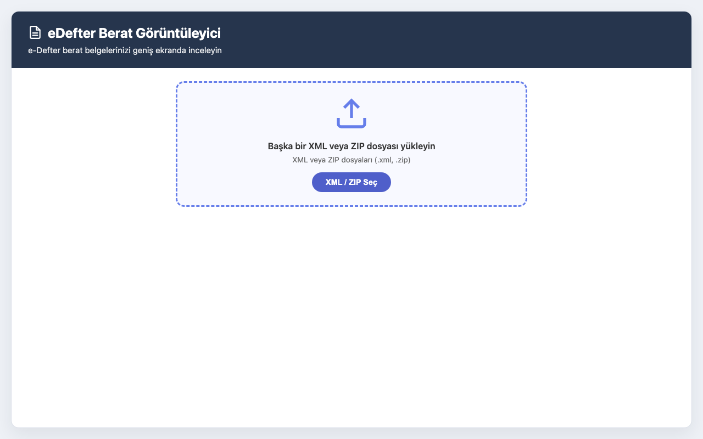
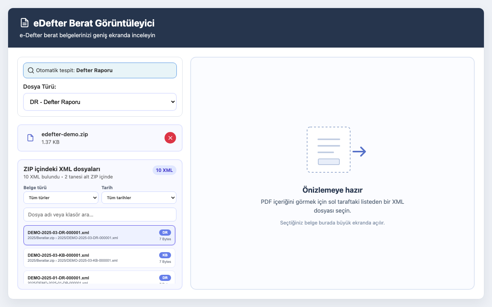
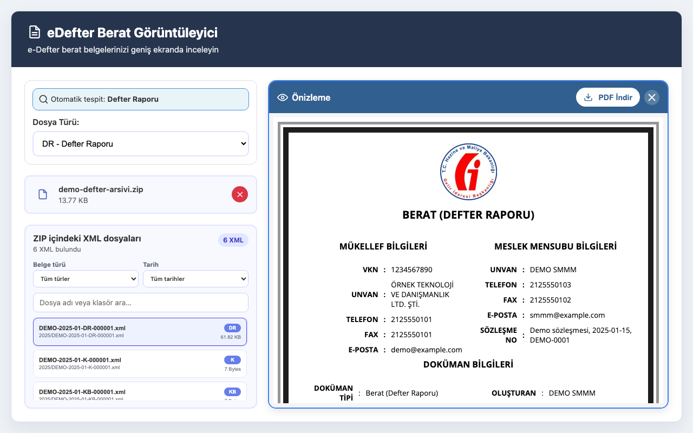

# eDefter Berat Görüntüleyici

Bu proje e-Defter berat XML dosyalarını ve ZIP arşivlerini geniş ekranda görüntülemenizi, önizlemenizi ve PDF olarak indirmenizi sağlar. Chrome eklentisi olarak veya Windows masaüstü uygulaması olarak kullanılabilir.

## Ekran Görüntüleri

| Dosya yükleme | ZIP filtreleri ve seçim ekranı |
| --- | --- |
|  |  |

| Defter raporu önizlemesi | Büyük defter beratı önizlemesi |
| --- | --- |
|  |  |

## Özellikler

- **Otomatik Görüntüleme**: XML dosyasını Chrome'da açtığınızda belge görüntüleme ekranı otomatik olarak açılır
- Sürükleyip bırakma ile dosya yükleme
- XML ve toplu ZIP dosyaları için popup'tan tam sayfa çalışma ekranına geçiş
- Otomatik dosya türü tespiti (dosya adından ve XML içeriğinden)
- Dosya türü seçimi (DR, KB, YB, K, Y) - otomatik tespit edilen türü manuel olarak değiştirebilirsiniz
- HTML önizleme - PDF oluşturmadan önce görünümü kontrol edin
- PDF indirme - Önizlemeden doğrudan PDF dosyası indirme
- Direkt yazdırma desteği
- Modern ve kullanıcı dostu arayüz

## Kurulum

### 1. Eklentiyi Yükleme

1. Chrome tarayıcınızı açın
2. Adres çubuğuna `chrome://extensions/` yazın ve Enter'a basın
3. Sağ üst köşede "Geliştirici modu" (Developer mode) seçeneğini açın
4. "Paketlenmemiş uzantı yükle" (Load unpacked) butonuna tıklayın
5. `manifest.json` dosyasının bulunduğu proje klasörünü seçin
6. Eklenti yüklenecek ve Chrome araç çubuğunda görünecektir

### 2. Simge Dosyalarını Ekleme (İsteğe Bağlı)

Eklentinin simge dosyalarını eklemek için:

1. Proje kökünde `icons/` klasörü oluşturup aşağıdaki boyutlarda simge dosyaları ekleyin:
   - `icon16.png` (16x16 piksel)
   - `icon48.png` (48x48 piksel)
   - `icon128.png` (128x128 piksel)

2. Simge dosyaları yoksa Chrome varsayılan bir simge gösterir; eklenti yine çalışır.

### 3. Windows Uygulaması

Windows 10 veya 11 ve WebView2 gerekir (güncel Windows sürümlerinde genelde yüklüdür).

1. GitHub Actions `Windows desktop` işinin ürettiği NSIS kurulumunu indirin veya proje kökünde `npm run build` çalıştırın
2. `eDefter Berat Goruntuleyici_1.0.9_x64-setup.exe` dosyasını çalıştırın
3. Kurulumdan sonra bir `.xml` veya `.zip` dosyasına sağ tıklayıp **Berat Görüntüleyici ile aç** seçin
4. Windows 11 kısa menüsünde seçenek görünmezse **Daha fazla seçenek göster** ile klasik menüyü açın

Kurulum varsayılan XML veya ZIP açıcısını değiştirmez. Uygulama kaldırıldığında Explorer menü kaydı da silinir.

Windows kurulumunu bu makinede üretmek için:

```
npm run build
```

Kurulum dosyası `desktop/src-tauri/target/release/bundle/nsis/` altında oluşur. Windows uygulamasını macOS veya Linux üzerinde paketlemek desteklenmez; paketleme Windows'ta veya GitHub Actions ile yapılır.

GitHub Release için sürüm etiketini push edin. `Windows desktop` işi kurulumu derler ve `v1.0.9` gibi etiketlerde Release sayfasına ekler:

```
git tag v1.0.9
git push origin v1.0.9
```

## Kullanım

### Yöntem 1: Otomatik Görüntüleme (Önerilen)

1. XML dosyanızı Chrome'da açın (dosyaya çift tıklayın veya Chrome'dan File > Open ile açın)
2. Eklenti XML dosyasını otomatik olarak tespit eder
3. Dosya türü otomatik olarak belirlenir
4. Belge görüntüleme ekranı otomatik olarak açılır
5. "PDF İndir" butonuna tıklayarak PDF'i kaydedin veya "Yazdır" butonu ile yazdırın

### Yöntem 2: Popup ile Kullanım

1. Chrome araç çubuğundaki eklenti simgesine tıklayın
2. Açılan popup pencerede XML dosyanızı sürükleyip bırakın veya "XML / ZIP Seç" butonuna tıklayın
3. Dosya normal boyutlu yeni bir tarayıcı sekmesine aktarılır
4. Sistem dosya türünü otomatik tespit eder; gerekirse sol panelden değiştirebilirsiniz
5. Önizleme başlığındaki "PDF İndir" butonuna tıklayın
6. PDF dosyası otomatik olarak indirilecektir

### Yöntem 3: Toplu ZIP ile Kullanım

1. Eklenti penceresini açın
2. ZIP dosyanızı sürükleyip bırakın veya "XML / ZIP Seç" butonunu kullanın
3. ZIP, popup'tan normal boyutlu yeni bir tarayıcı sekmesine aktarılır; dosyayı yeniden seçmeniz gerekmez
4. ZIP'in klasörlerindeki ve en fazla 3 seviye iç içe ZIP'lerdeki XML dosyaları listelenir
5. Belge türü (DR, K, KB, Y, YB), kurum ve dönem tarihi filtreleriyle listeyi daraltın
6. Listeden bir XML'e tıklayarak türünü ve önizlemesini görüntüleyin
7. Seçili XML'i önizleme başlığındaki "PDF İndir" butonuyla doğrudan PDF olarak indirin

Güvenli ve akıcı kullanım için ZIP boyutu 50 MB, her XML dosyası 10 MB ve arşiv başına liste 500 XML ile sınırlıdır. Şifreli ZIP dosyaları desteklenmez.

### Yöntem 4: Windows Explorer ile Kullanım

1. Windows uygulamasını kurun
2. Bir XML veya ZIP dosyasına sağ tıklayıp **Berat Görüntüleyici ile aç** seçin
3. Uygulama zaten açıksa yeni dosya mevcut pencerede yüklenir
4. İsterseniz uygulamayı başlatıp dosyayı sürükleyip bırakabilirsiniz

## Desteklenen Dosya Türleri

| Dosya Türü | XSLT Dosyası | Açıklama |
|------------|--------------|----------|
| DR | defterraporu.xslt | Defter Raporu |
| KB | berat.xslt | Büyük Defter Beratı |
| YB | berat.xslt | Yevmiye Beratı |
| K | kebir.xslt | Kebir Defteri |
| Y | yevmiye.xslt | Yevmiye Defteri |

## Teknik Detaylar

- **Manifest Version**: 3
- **Windows uygulaması**: Tauri 2, sistem WebView2
- **XSLT İşleme**: Tarayıcı içinde, yerel WASM XSLT polyfill ile
- **PDF Oluşturma**: Yerel html2canvas + jsPDF ile doğrudan A4 PDF üretimi
- **Dosya Okuma**: FileReader API (eklenti) veya seçilen dosya yolu (Windows)
- **ZIP Okuma**: JSZip 3.10.1 (eklenti içinde yerel olarak paketlenmiştir)
- **Türkçe Karakter Desteği**: Open Sans fontu (Google Fonts)

## Sorun Giderme

### XSLT Uyarısı (crbug.com/435623334)
Eklenti, Chrome’un kaldırma planına karşı yerel WASM tabanlı XSLT polyfill’i kullanır. Yeni dönüşümlerde native `XSLTProcessor` uyarısı oluşmamalıdır. Daha önce oluşmuş kayıtlar Chrome’un eklenti hataları ekranında kalabilir; bir kez “Tümünü temizle” ile silinebilir.

### Eklenti yüklenmiyor
- `chrome://extensions/` sayfasında "Geliştirici modu"nun açık olduğundan emin olun
- `manifest.json` dosyasının bulunduğu proje klasörünün doğru seçildiğinden emin olun

### XML dosyası otomatik dönüştürülmüyor
- XML dosyasını Chrome'da açtığınızda eklentinin aktif olduğundan emin olun
- `chrome://extensions/` sayfasında eklentinin etkin olduğunu kontrol edin
- Dosya yolunun `file://` protokolü ile açıldığından emin olun
- Eğer çalışmazsa, popup yöntemini kullanabilirsiniz

### XSLT dosyası bulunamadı
- `xslt/` klasöründe tüm XSLT dosyalarının olduğundan emin olun
- Dosya adlarının doğru olduğundan emin olun (küçük harf)

### PDF oluşturulamıyor
- Eklentiyi `chrome://extensions/` üzerinden yenileyip tekrar deneyin
- İndirilenler klasöründe dosyanın oluştuğunu kontrol edin
- Tarayıcı konsolunda hata mesajlarını kontrol edin (F12)

### Türkçe karakterler görünmüyor
- İnternet bağlantınızın olduğundan emin olun (Google Fonts yüklenmesi için)
- Font yüklemesi için birkaç saniye bekleyin

## Geliştirme

Eklentiyi geliştirmek için:

1. Proje kökündeki dosyaları düzenleyin
2. `chrome://extensions/` sayfasında eklentinin yanındaki Yenile düğmesine tıklayın
3. Değişiklikler otomatik olarak yüklenecektir

Windows uygulamasını geliştirmek için proje kökünde `npm run dev` kullanın. Görüntüleyici arayüzü eklenti ile ortaktır (`popup.html`). Windows installer `Windows desktop` GitHub Actions işi ile de üretilebilir.

## Notlar

- Eklenti ve Windows uygulaması tamamen yerel çalışır, sunucuya veri göndermez
- Tüm işlemler cihazınızda gerçekleşir
- Dosyalar sadece yerel olarak işlenir, hiçbir veri dışarı gönderilmez
- PDF, tarayıcı yazdırma penceresi açılmadan yerel olarak oluşturulup indirilir. Kanvas ve PDF boyutu doğrulanır; boş çıktı oluşursa indirme başarısız olarak bildirilir.

## Lisans

Bu proje orijinal web uygulaması ile aynı lisans altındadır.
